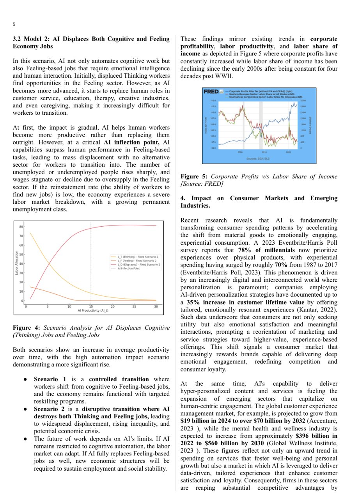
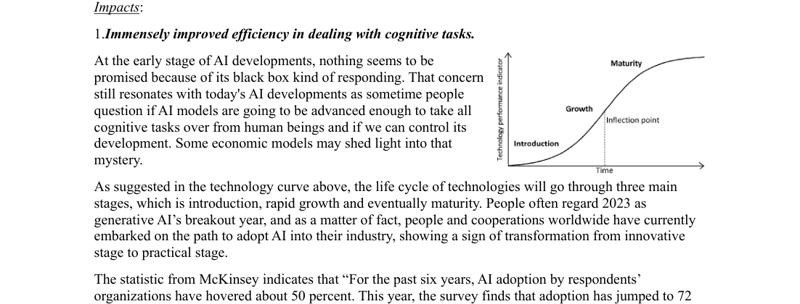
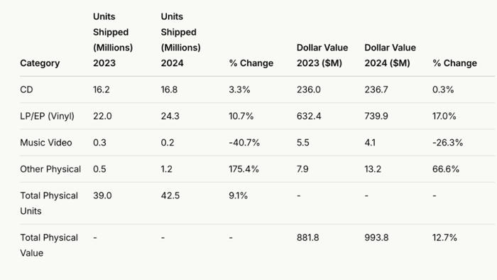
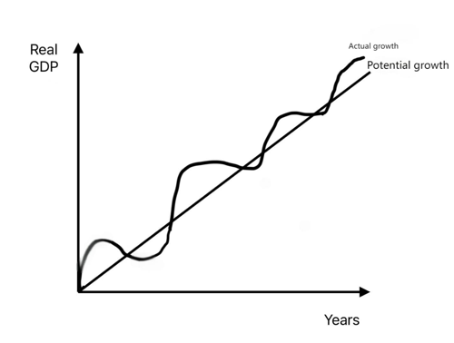
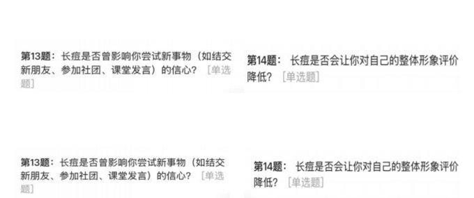
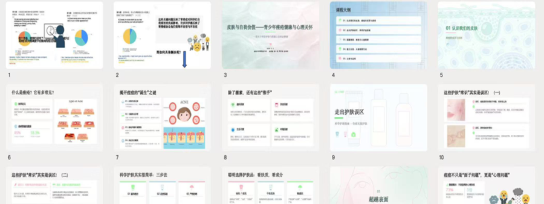
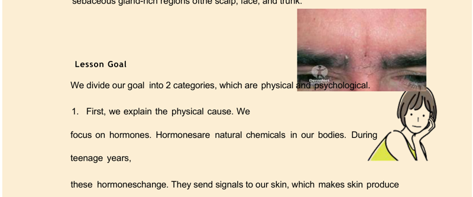
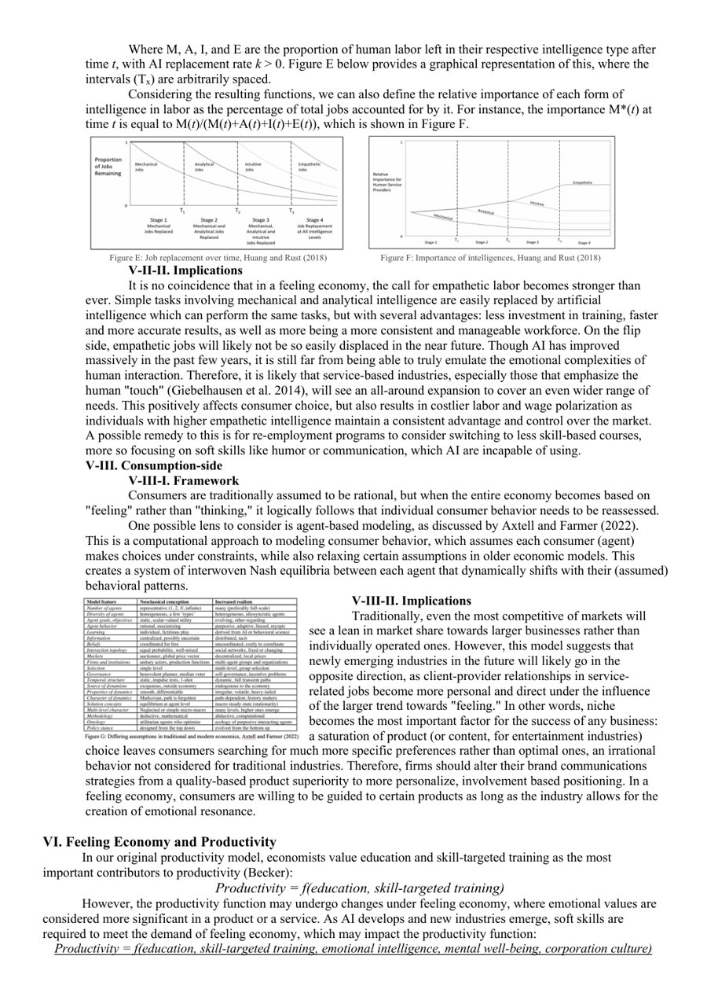

<div align="center">

# 📄 PDF to Markdown（PDF 转 Markdown）复杂排版识别工具

### 专治多栏、图文混排、复杂图表这类「一般工具转出来就乱」的 PDF，老老实实变成能读、能核对、不丢内容的 Markdown

[](./CHANGELOG.md)
[](./LICENSE)
[](#快速开始)
[](#作为-claude-code--workbuddy-skill-使用)

一个专门解决 **PDF 转 Markdown（PDF to Markdown）** 里最难啃部分（复杂排版）的
[Claude Code](https://claude.com/claude-code) / WorkBuddy Skill，配一套 PyMuPDF 抽取脚本。
专治学生论文、竞赛作品、项目报告这类**版式比标准学术期刊杂乱得多**的 PDF：多栏、图文混排、
各种图表都能处理，不是只会转规规矩矩的单栏文档。

</div>

---

## 🎯 目前覆盖 26 个真实踩过的复杂排版场景

不是理论上列出来的清单，是真的拿几十份学生提交的 PDF 一份一份啃出来的——每一条背后都有真实文档、真实 bug、真实修复记录。按「正文怎么读对」「图表怎么看懂」「版面到底有几栏」三个层面分类：

<table>
<tr><td valign="top" width="33%">

**📝 正文抽取（9）**
1. 纯英文/中英混排分栏识别
2. 居中表单字段/封面署名行
3. 图内嵌图标留下的占位符
4. 装饰字体导致标题乱码
5. 三种段落边界（缩进/空行/短行）
6. 图片打断段落合并逻辑
7. 行归属丢失导致内容消失
8. 页边距过滤过紧丢句子
9. 加密/DRM 封装 PDF 识别

</td><td valign="top" width="33%">

**🖼️ 图表识别与标注（12）**
10. 图片三段式标注方法
11. 图表详略比例判断
12. 多图紧贴裁剪失败
13. 整页背景图误判
14. 复合网格图（一图多子图）
15. 页码错位/图片错配页
16. 并排拼接图（一图两内容）
17. 图表浮动嵌在段落中
18. 无坐标概念性曲线图
19. 图片与正文空间重叠
20. 规整表格直接转 Markdown
21. 信息图/海报式版式（已知限制）

</td><td valign="top" width="33%">

**📰 多栏版式识别（5）**
22. 真双栏论文的正确抽取
23. 双栏正文重写方法论
24. 稀疏栏漏检（已知限制）
25. 单栏被「假栏」骗成双栏
26. 页码标注因文档而异

</td></tr>
</table>

> 每一条都能在 [`SKILL.md`](./SKILL.md) 里查到对应章节，写清楚了**现象、根因、怎么修的**，不少条目还记录了「第一版怎么改错的、为什么错、后来怎么改对的」——不是只列一份成功清单。

---

## 🤔 「复杂排版」到底是什么意思？（大白话版）

如果你不是天天跟 PDF 打交道的人，可能根本不知道「复杂排版」在说什么。这里用大白话讲清楚我们具体在处理什么问题：

### 1️⃣ 多栏排版——一页纸被分成好几条竖着的文字流

报纸、杂志、学术论文最常见：一页纸左右分成两栏（甚至三栏、四栏、五栏、六栏）文字，要先读完左边那一整条，再读右边那一整条，不是简单地从上到下读。

大多数工具分不清「这是两栏」还是「这是一栏很宽的文字」，结果就是**把左栏读到一半，突然蹦到右栏最上面，再蹦回左栏**——整段话读起来语无伦次，或者更糟：两栏内容被拼成了一句话。

<p align="center"><br>
<sub>真实的双栏论文页面：必须先读完左边整栏，再读右边整栏，顺序不能错</sub></p>

我们不仅要能**识别出这是几栏**，还要**保证读的顺序是对的**——这件事我们踩过好几次坑（见下面的踩坑记录），也是投入精力最多的部分。

### 2️⃣ 图文混排——图片直接「长」在文字里面

不是「一段文字、一张独立的图」这种规规矩矩的排版，而是图片直接嵌在段落中间、文字绕着图片的形状走，一会儿宽一会儿窄。人眼读起来没问题，但机器很容易把「环绕图片的这一小段窄文字」误判成一个独立的分栏，或者把图和文字的归属搞混。

<p align="center"><br>
<sub>一张小图直接嵌在段落正中间，前后文字环绕着它变窄——这种版式最容易把图文关系读乱</sub></p>

### 3️⃣ 图表识别——规整的表格，能还原成真正的表格

如果图片本身就是一张**排版整齐、有清楚行列结构**的表格截图（比如一份数据统计表），我们不会偷懒写成「这里有个表格，大概讲了 xxx」，而是把每一行每一列的数字**原样还原成一份可以直接复制使用的 Markdown 表格**。

<p align="center"><br>
<sub>这种行列分明的表格截图，会被完整还原成 Markdown 表格，数字一个不漏</sub></p>

### 4️⃣ 复杂图表——折线图、曲线图这种，得先认出是哪种「图」

真正难的是那些**没有整齐行列、纯靠图形表达信息**的图表：折线图、饼图、经济学里的供需曲线图、甚至有些图连坐标刻度都没有、只靠「线的形状」传达信息。这类图不能只写一句「这是一张图表」敷衍过去，要先**判断这到底是哪一类图**（有数据的统计图？没有刻度的概念曲线图？），再针对性地把趋势、走向、关键数值讲清楚。

<p align="center"><br>
<sub>这类图连一个具体数字都没有，纯靠「线的形状」传达信息，必须先认出图表类型才能描述对</sub></p>

---

## 📸 我们踩过的坑，长这样（配图讲解）

下面是几个真实场景的示意图（**均已隐去或替换掉姓名、学校等个人信息，只保留跟排版识别相关的内容**）。文字论证类的截图属于常规文本内容，直接展示不涉及隐私问题。

<details open>
<summary><b>并排拼接图：一张图片里塞了两道题/两块内容</b>（对应场景 16）</summary>
<br>

问卷平台导出截图时，经常把相邻两道题的内容拼成一张又宽又扁的图。乍一看像是「跨栏排版」，其实是设计工具导出时的合并行为。我们的判断信号是「宽高比明显偏宽、左右两半各自独立完整」，识别出来后用 1×2 均分切分成两张独立的图分别描述：

<p align="center"></p>
</details>

<details open>
<summary><b>复合网格图：一张图片内部其实是一整个网格</b>（对应场景 14）</summary>
<br>

PPT/Slides 的「缩略图网格视图」导出后，在 PDF 结构里只是**一张图片**，内部藏着几十个子图/子图表，PDF 本身完全没有记录每个格子的坐标。我们会自动检测网格的行列结构并逐格切分：

<p align="center"><br>
<sub>整张图其实是一份完整 PPT 的 23 张幻灯片缩略图拼在一起，逐格识别、按各自的编号对应内容</sub></p>
</details>

<details open>
<summary><b>图片和正文文字空间重叠</b>（对应场景 19）</summary>
<br>

自由排版的文档（PPT/Canva 导出）里，装饰性图片经常直接压在正文文字上面，图片彼此之间也会互相压角。裁图逻辑是「对整页截屏再裁切」，如果图片和文字发生重叠，裁出来的图片文件会把重叠区域的正文文字也一起「烤」进去，需要专门识别哪些是图片本身内容、哪些是渗入的正文残留：

<p align="center"><br>
<sub>两张插画彼此压角叠放，还都压在下面一行正文上——裁切出来的图片文件里会带出正文文字的残留</sub></p>
</details>

<details open>
<summary><b>单栏文档被「假栏」骗成双栏，正确的排序反而被打乱</b>（对应场景 25）</summary>
<br>

这是我们修过的一个真实 bug：单栏文档里，如果某处有一张图片、文字绕着它环绕排版变窄（见上面「图文混排」），只要这段窄文字连续行数够多、位置又够稳定，就会被误判成一个「真正的第二栏」。一旦被误判，系统会按「先读完左栏、再读右栏」的双栏逻辑重排全文，结果把本来该按顺序出现的两张图表拆开、插到了一张完全无关的图片后面：

<p align="center"><br>
<sub>页面中部本来是两张并排展示的图表（左）+ 一段绕排文字（图文混排），页面下方另有一张无关的表格图（右下）——被误判成双栏后，两张并排图表的相对顺序被打乱</sub></p>

**怎么修的**：拿两份真实文档（一份真双栏、一份误判的假栏）的数据做校准，比较候选栏之间的行数比例——真栏两栏行数差不多，假栏的行数远少于真正贯穿全页的主栏，中间留了接近 2 倍的安全边界去区分。
</details>

> 还有更多没配图的坑（装饰字体乱码、加密 PDF 识别、页码错位根因排查等），因为本身是纯文本层面的问题、截图意义不大，完整记录都在 [`SKILL.md`](./SKILL.md) 里，一节一节按真实事故顺序写的。

---

## 这是什么场景下用

市面上大多数 PDF 转 Markdown 的工具，默认假设的是规规矩矩的单栏文档：一页从上到下一条文字流，图片各自独立、跟正文互不打扰。真实世界的 PDF 不是这样的，尤其是**学生提交的论文、竞赛作品、课程项目报告**——这类材料通常不是用 LaTeX 排出来的标准学术期刊版式，而是 Word / PPT / Canva / Google Slides 随手导出的，版式自由到近乎「想怎么排就怎么排」。

直接拿通用工具抽取，轻则段落顺序错乱、图文对不上，重则整段内容**无声消失**、自己都发现不了。这个项目把每一个真实坑的现象、根因、修法都记录下来，沉淀成一套可复用、可自查、可持续迭代的抽取方法论 + 脚本工具。

**典型使用场景**：
- 老师/助教批量核对学生提交的项目报告、竞赛作品，需要把 PDF 转成方便通读、方便逐段核对原文的 Markdown；
- 需要把图表里的数据、图注、上下文关联关系完整保留下来，而不是「图片抠出来就没了下文」；
- 需要确认「这份 PDF 到底有没有被正确抽取」，而不是盲信一个黑盒工具的输出。

---

## 我们覆盖哪些复杂排版（详细对照表）

### 一、正文抽取层面

| # | 场景 | 说明 | 对应章节 |
|---|---|---|---|
| 1 | 纯英文/中英混排文档分栏检测 | 分栏候选判据不能只认中文字符，否则纯英文文档的分栏检测直接失效 | §1.1 |
| 2 | 居中表单字段行 | 封面署名、「Team Name: xxx」这类居中短行，不能被段落合并逻辑误吞 | §1.2 |
| 3 | 行内图片占位符残留 | PDF 文字流里嵌入小图标留下的不可见占位符字符要清理干净 | §1.3 |
| 4 | 装饰字体标题乱码 | 非常规展示字体的 cmap 映射错位会导致「看起来像文字的乱码」，检测嫌疑后用 OCR 重新识别替换 | §1.4 |
| 5 | 段落边界不止「首行缩进」一种 | 空行分段、短行收尾分段（国际学生写作常见）都要认，三种判据按优先级不互斥判断 | §1.5 |
| 6 | 图片打断段落/标题合并逻辑 | 图片插在被切断的标题或句子中间时，合并逻辑要「透明跳过」图片块，不能被打断 | §1.6 |
| 7 | 行归属丢失导致内容消失 | 找不到匹配栏位的行不能直接丢弃，要退回「最近的栏」兜底 | §1.7 |
| 8 | 页面边距过滤过紧 | 边距参数只用来挡物理边缘出血/裁切线，卡太死会连正文最后一行都切掉 | §1.8 |
| 9 | 加密/DRM 封装 PDF | 企业级 DRM 包装（如 `%TSD-Header-###%`）的识别方法，跟传输/下载损坏区分开 | §3 |

### 二、图片/图表抽取与标注层面

| # | 场景 | 说明 | 对应章节 |
|---|---|---|---|
| 10 | 图片三段式标注 | 每张图拆成【图片内文字 OCR】【视觉内容描述】【关联文字】三部分，不是简单一句话带过 | §6.2 |
| 11 | 详略比例原则 | 有真实数据的图表要完整展开描述，纯装饰性缩略图给一两句话就够 | §6.3 |
| 12 | 多张图片彼此紧贴、裁剪失败 | 相册九宫格式排版找不到文字围栏时，改用整页原图重新核对 | §6.4 |
| 13 | 整页背景纹理图误判 | Canva/Slides 导出的全页背景纹理图会被误判成「有内容图片」，判据必须同时看「面积占比」和「该页有没有其他实质文字」 | §6.4b |
| 14 | 复合网格图片 | 一张图片内部其实是一整个网格的子图/子图表（PPT 缩略图库、多题统计图拼接），提供自动检测 + 手动等分两套切分方案 | §6.6 |
| 15 | 页码错位、图片错配页 | 系统性排查 4 个真实根因：0/1 起始页码换算不统一、误判「同一页」、跨会话记忆过期、网格裁切边界不准 | §6.7 |
| 16 | 并排拼接图 | 一张图片横向塞了两个逻辑单元（两道题的截图/两张图表拼一张），用 1×2 均分切分识别处理 | §6.8 |
| 17 | 图表与正文混排 | 小图直接浮动嵌在段落内部、文字环绕变窄，准确判断每张图对应哪段说明文字（可能跨段跨页） | §6.9a |
| 18 | 纯概念性曲线图 | 没有坐标刻度和具体数值、只靠线形和相对位置传达信息的手绘概念图，专门的读图方法 | §6.9b |
| 19 | 图片和正文空间重叠 | 图片裁切用整页截屏再裁切，重叠区域会把正文文字「烤」进图片文件，要识别并排除这类渗入 | §6.9 |
| 20 | 规整数据表格 | 图片内容能划分出统一行列的，直接还原成 Markdown 表格，不写成散文 | §6.2 |
| 21 | 信息图/海报式版式 | 无规则文本框的自由排版，管线本质上无法可靠处理，如实标注为已知限制，改用整页重新核对 | §2（已知未解决） |

### 三、多栏版式识别层面（最容易踩坑、也是本项目投入精力最多的部分）

| # | 场景 | 说明 | 对应章节 |
|---|---|---|---|
| 22 | 真双栏学术论文的正确抽取 | 图文合并排序、换栏处段落合并、悬挂缩进列表识别——三个独立 bug，逐一发现、修复、回归测试 | §6.10 |
| 23 | 双栏文档的正文重写方法论 | 双栏页面必须用管线按栏分组后的真实输出核对/重写，不能靠不借助工具的直接扫读——两栏内容在同一 y 高度附近极易被误读成「顺着读下来的一句话」 | §6.10 |
| 24 | 稀疏栏（已知限制） | 某一栏在某页只有一两行内容时（被图片占掉大半版面）会漏检，记录了一次校准失败的尝试和后续正确修法的方向 | §6.11 |
| 25 | 单栏文档被「假栏」骗成双栏 | 文字环绕图片产生的窄列被误判成真正的第二栏，导致「栏优先」排序把正确的阅读顺序打乱；用两份真实文档的数据校准了行数比例判据 | §6.11b |
| 26 | 页码标注约定因文档而异 | 「内页页码」和「PDF 物理页码」的对应关系每份文档都可能不同（封面算不算页、有没有印页码、页码印在页眉页脚还是页面角落），必须逐份核实，不能照搬上一份的经验 | §6.1 |

> **MECE 说明**：以上分类按「正文抽取 / 图片标注 / 多栏识别」三个独立层面划分，同一个坑只归入它的根因所在层面，不重复计入。每新增一个真实场景，都会先判断它落在哪个层面、跟已有条目是否本质相同，避免同一类问题在文档里出现两次不同的描述。

---

## 输出物长什么样

最终产出是一份**逐页对照的 Markdown**，设计原则是「读者拿到手不用再回头翻原 PDF 去确认对不对」——正文、图片、页码、版式细节都要在文字里交代清楚。下面是一个示意结构（内容为演示用途虚构，非真实文档）：

<table>
<tr><th>产出物包含什么</th><th>示例</th></tr>
<tr><td>

**1. 页码双重标注**
物理页序 + 印刷页码分开标，且提前核实过对应关系

</td><td>

```markdown
## PDF 第 5 页（内页页码 4，左右两栏各嵌一张图表）
```

</td></tr>
<tr><td>

**2. 正文先完整给出**
按真实阅读顺序（双栏就先左栏后右栏），不是照抄原始坐标顺序

</td><td>

```markdown
### 正常排版正文（左栏，从上到下）

AI 正在重塑劳动力市场的结构……
（此处嵌入 Figure 2 图表，见下方"本页图片"第 1 张）

**Figure 2: 各行业劳动力份额变化，2018–2024**
```

</td></tr>
<tr><td>

**3. 图片在正文里用占位标记**
不是把图片全丢到文末，而是标出它在正文流里的真实插入位置，像书里的「见图 1」一样可以按图索骥

</td><td>

```markdown
（此处嵌入 Figure 2 图表，见下方"本页图片"第 1 张）
```

</td></tr>
<tr><td>

**4. 换栏/换页会显式说明**
读者能分清「这是版式导致的正常切分」还是「真的丢内容了」

</td><td>

```markdown
（左栏到此结束。这三条要点在 PDF 里是无编号项目符号，
排版压缩成了好几行，如实说明原始版式。）

（这句话直接接到下一页"然而，这一趋势……"，
跟 PDF 第 6 页首句是同一段，未被段落边界打断。）
```

</td></tr>
<tr><td>

**5. 每张图片三段式标注**
OCR 文字、视觉内容描述、关联文字分开写，不是一句话带过

</td><td>

```markdown
### 本页图片（共 1 张）

**1. Figure 2：各行业劳动力份额变化折线图**
- 【图片内文字（OCR）】纵轴「Share of Labor (%)」0–40，
  横轴年份 2018–2024，图例「制造业」「零售业」「专业服务」
- 【图片内容描述（视觉识别）】三条折线，制造业持续下滑
  （从 32% 降至 21%），专业服务稳步上升（18% 升至 29%），
  零售业基本持平，2020 年附近三条线均有短暂波动……
- 【图片下方/旁侧关联文字】图注"Figure 2: 各行业劳动力
  份额变化，2018–2024"紧邻图片下方；对应分析文字见图片
  上方"AI 正在重塑劳动力市场的结构……"一段
```

</td></tr>
<tr><td>

**6. 规整数据表格直接还原成表格**
不是转写成一句句项目符号

</td><td>

```markdown
| Category | 2023 | 2024 | % Change |
|---|---|---|---|
| CD | 16.2 | 16.8 | 3.3% |
| Vinyl | 22.0 | 24.3 | 10.7% |
```

</td></tr>
</table>

---

## 快速开始

```bash
# 装依赖（只需要 PyMuPDF）
pip install pymupdf

# 第一步：探版式，决定抽取策略（有没有文字层、单栏还是双栏、栏起点分布）
python scripts/probe.py 你的文件.pdf

# 第二步：抽取正文 + 图表，输出结构化 JSON
python scripts/pdf-extract-columns.py 你的文件.pdf raw.json --img-out images/

# 第三步：后处理（标点规范化、断词、未完句合并、标题识别）
python scripts/text-normalize.py raw.json art.json

# 双栏及以上版式：核对分栏识别结果是否正确，再动手整理成最终 Markdown
python scripts/verify-columns.py 你的文件.pdf
```

`art.json` 是结构化的块列表（`p`/`h`/`field`/`image` 等类型），最后一步「整理成带三段式图片标注的最终 Markdown」由**执行这个 skill 的 AI**（不是人）按 [`SKILL.md` §6](./SKILL.md) 的格式规范完成——这一步需要真正「看图说话」的图像理解能力，暂时没有把它也脚本化，详见[已知限制](#已知限制)。

### 作为 Claude Code / WorkBuddy Skill 使用

把整个仓库放进 `~/.claude/skills/pdf-to-markdown/`（或 WorkBuddy 对应的 skills 目录），Claude Code 会自动读取 `SKILL.md` 里的触发词（「学生论文」「多栏 PDF」「论文解析」「答卷/作品 PDF 提取」等）识别场景并调用。不需要额外配置。

---

## OCR 能力

图片内文字识别默认走 **Apple Vision**（macOS 系统自带的端侧 OCR 框架），通过一个几十行的 Swift 脚本调用：

```bash
ssh 你的Mac设备 'swift ~/bin/vocr.swift <图片路径>'
```

选它的原因很直接：**免费、端侧运行不上传数据、中英文识别准确率都很高、速度快**。项目里用来兜底两种场景——装饰字体导致的标题乱码（§1.4）、图表里文字的识别（§6.2）。

> ⚠️ **重要说明：OCR 结果的核对，是 AI 自己做的，不是要真人去校对。** 无论用哪种 OCR 引擎，识别结果都不能直接照抄——实测在小尺寸图表（问卷统计图、坐标轴数字）上出错率不低。但「逐字核对修正」这一步是**执行这个 skill 的多模态 AI 模型自己直接看原图、对照 OCR 结果逐字修正**，全程不需要人工介入。这条原则跟具体用哪个 OCR 引擎无关，只要模型本身有看图能力（多模态），换成任何一种 OCR 引擎都适用。

**没有 macOS 设备怎么办？** 以下是效果排序过的备选方案，任选其一替换掉 `vocr.swift` 那一步即可，其余整套抽取/标注方法论不受影响：

| 方案 | 适合场景 | 备注 |
|---|---|---|
| [PaddleOCR](https://github.com/PaddlePaddle/PaddleOCR) | 中文/中英混排为主 | 开源、免费、本地跑，中文识别效果通常优于 Tesseract，装好模型后离线可用 |
| [Tesseract OCR](https://github.com/tesseract-ocr/tesseract) | 纯英文/拉丁字母文档 | 最成熟的开源 OCR，`pytesseract` 一行代码调用，中文效果一般 |
| 云端 OCR API（百度 OCR / 腾讯 OCR / Google Cloud Vision / Azure Computer Vision） | 对准确率要求高、能接受数据出本地 | 效果通常最好，尤其是复杂版式/艺术字，但要过网络、要花钱、要过隐私合规 |

---

## 已知限制

诚实列出目前做不到/做不好的地方，不打包票：

- **信息图/海报式版式**（无规则文本框、纯视觉设计驱动的排版）本质上不是「有栏可分」的版式，管线抽取效果差，只能靠整页渲染 + AI 重新核对，见 §2。
- **稀疏栏**（某一栏在某页只有一两行内容）目前检测不出来，见 §6.11——这是一个已经排查清楚根因、但还没找到安全修法的已知 bug，留档等真实场景出现时再校准。
- **最后一步「整理成带三段式标注的最终 Markdown」依赖 AI 的图像理解能力**，不是纯脚本自动完成——这是有意为之：图表的视觉内容描述需要真正「看懂」图表在说什么，而不是抠出像素或跑一遍 OCR 就够，但这一步全程是 AI 在做，不需要人参与。
- 目前的真实测试样本以英文/中英混排的学生论文、竞赛作品为主，其他语言、其他文档类型（合同、简历、扫描件等）未经充分验证。

---

## 后续迭代

这个项目会持续跟进真实场景中踩到的新坑——每一次「发现新的复杂排版场景」或「修复一个真实 bug」都会：

1. 直接改进脚本本身，而不是只在文档里记一条「已知限制」敷衍过去；
2. 用真实文档做回归测试，确保新修复不破坏已经验证过的场景；
3. 把现象、根因、修法完整写进 `SKILL.md` 对应章节，更新 `CHANGELOG.md`。

详见 [CHANGELOG.md](./CHANGELOG.md)。

---

## 联系方式

用起来遇到问题、发现新的复杂排版场景、或者单纯想聊聊，欢迎联系：

- 微信 / Gmail：**guxiaoqiang**

---

## License

[MIT](./LICENSE)
